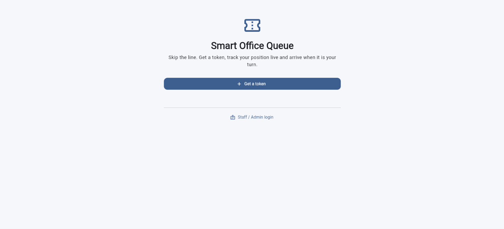
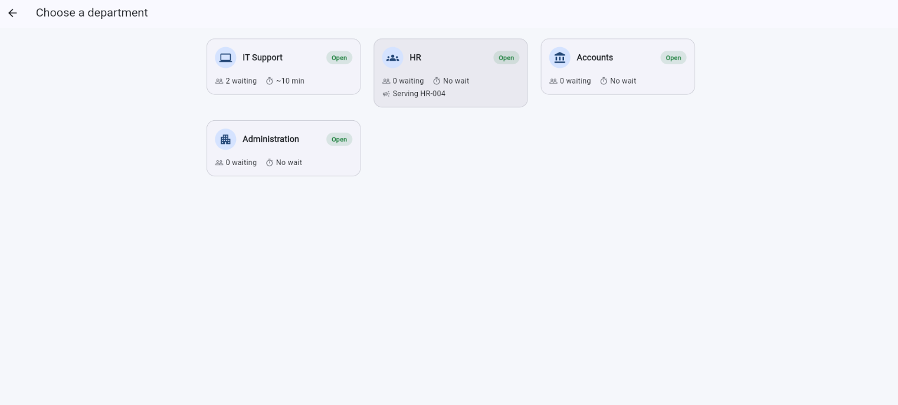
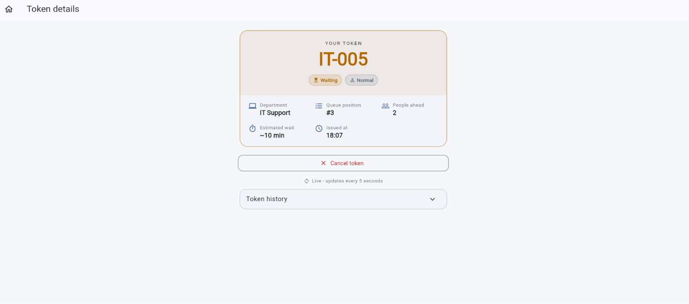
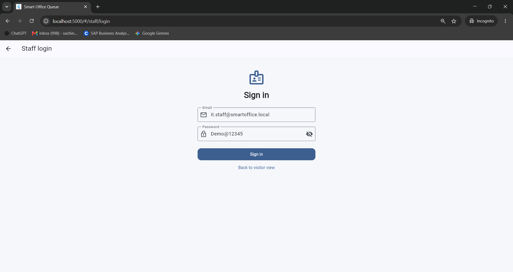
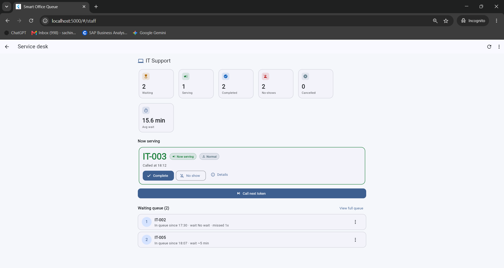
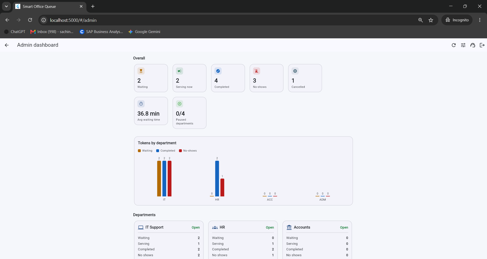
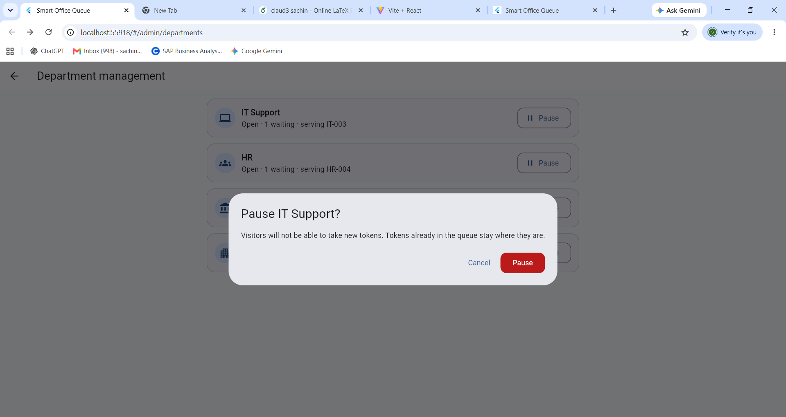
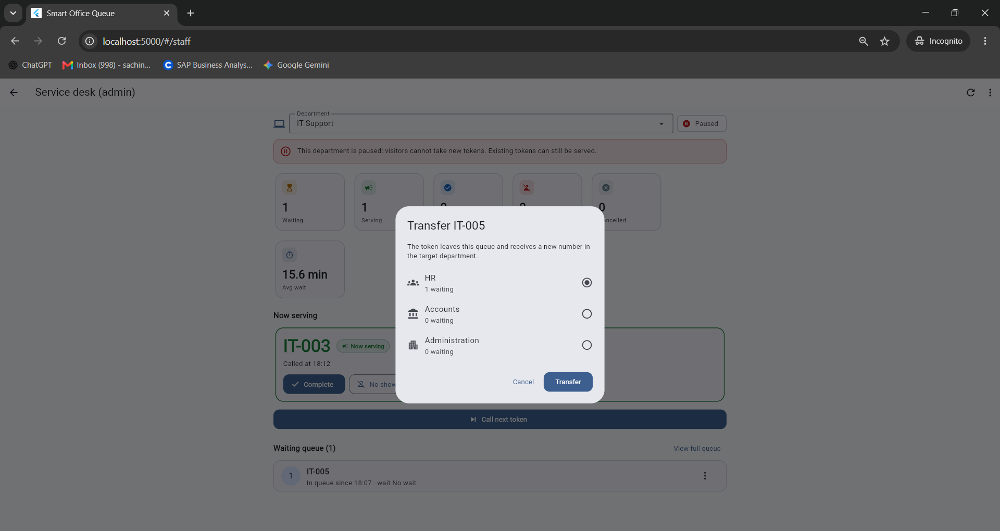

# Smart Office Queue & Token Management System

A full-stack office queue manager. Visitors pick a department, get a numbered token (`IT-001`, `HR-002`, ...) and watch their **live queue position and estimated waiting time**. Staff call, complete, skip (no-show) and transfer tokens. Admins pause/resume departments and see statistics.

| Layer | Technology |
|---|---|
| Frontend | Flutter (Dart), Material 3, Provider |
| Backend | Go (REST API, JWT, layered architecture) |
| Database | PostgreSQL (SQL migrations, FK + indexes, transactions) |

---

## Table of contents
1. [Screenshots](#1-screenshots)
2. [Requirements checklist](#2-requirements-checklist)
3. [Features](#3-features)
4. [Architecture](#4-architecture)
5. [Project structure](#5-project-structure)
6. [Prerequisites](#6-prerequisites)
7. [Setup & run (step by step)](#7-setup--run-step-by-step)
8. [Environment variables](#8-environment-variables)
9. [Test credentials](#9-test-credentials)
10. [Demo walkthrough](#10-demo-walkthrough)
11. [Queue logic explained](#11-queue-logic-explained)
12. [Database schema](#12-database-schema)
13. [API documentation](#13-api-documentation)
14. [Testing](#14-testing)
15. [Security](#15-security)
16. [Troubleshooting](#16-troubleshooting)
17. [Known limitations](#17-known-limitations)

---

## 1. Screenshots

<table>
  <tr>
    <td align="center"><br><sub>Home</sub></td>
    <td align="center"><br><sub>Department selection (live waiting count, paused status)</sub></td>
  </tr>
  <tr>
    <td align="center"><br><sub>Token details: live position and estimated wait</sub></td>
    <td align="center"><br><sub>Staff dashboard: now serving, call next, complete, no-show</sub></td>
  </tr>
  <tr>
    <td align="center"><br><sub>Waiting queue (priority first, then FIFO)</sub></td>
    <td align="center"><br><sub>Admin dashboard: totals, chart, department-wise statistics</sub></td>
  </tr>
  <tr>
    <td align="center"><br><sub>Paused department: new tokens are blocked</sub></td>
    <td align="center"><br><sub>Transfer a token to another department</sub></td>
  </tr>
</table>

---

## 2. Requirements checklist

| Requirement (from the assessment) | Where / how |
|---|---|
| Visitor token generation | `POST /api/tokens`, Flutter "Generate token" screen |
| Services: IT Support, HR, Accounts, Administration | seeded by migration `002_seed_departments.up.sql` |
| Unique token numbers (IT-001, HR-002 ...) | per-department atomic counter (`departments.last_token_seq`) |
| Separate department-wise queues | every query is scoped by `department_id` |
| Live queue position | computed on every request; app polls every 5 s |
| Estimated waiting time | people ahead x average service time (see section 11) |
| Token cancellation | visitors can cancel `WAITING` tokens only |
| Admin / Staff login | JWT + bcrypt, role-based authorization |
| Call Next Token | priority first, then FIFO; never while someone is being served |
| Complete Token | `SERVING -> COMPLETED`, stores `completed_at` |
| No Show: 1st moves to end, 2nd auto-cancels | backend logic + tests |
| Transfer token to another department | new token in the target department, history kept |
| Pause / resume a department | admin only; paused departments reject new tokens |
| Priority token | ahead of normal tokens, never interrupts the one being served |
| Dashboard: waiting, serving, completed, no-shows, average waiting time | admin dashboard + per-department statistics |
| Queue position / ETA update when the queue changes | never stored, always recalculated |

---

## 3. Features

**Visitor (no account needed)**
- Home, department selection with live waiting count / estimated wait / paused status
- Generate a **normal or priority** token
- Token details: token number, department, priority, status, **queue position**, **people ahead**, **estimated wait**, history timeline
- Cancel a waiting token (with confirmation)
- "It is your turn" banner when called, "moved to end of queue" notice after a no-show, follow a transferred token to its new number

**Staff** (own department)
- Now serving, waiting queue, statistics
- **Call next token**, **Complete**, **No show**, **Transfer** (with department picker), token details and history

**Admin** (all departments)
- Everything staff can do, for any department (department switcher)
- **Pause / resume** departments (department management screen)
- Overall dashboard: waiting, serving, completed, no-shows, cancelled, average waiting time, simple bar chart, department-wise statistics

---

## 4. Architecture

```
 Flutter app                                    Go API                                    PostgreSQL
┌────────────────────────┐   HTTP / JSON    ┌───────────────────────────────┐   pgx    ┌────────────────┐
│ screens / widgets      │   (poll every    │ handler  routes, JWT, JSON    │          │ departments    │
│        ▲               │    5 seconds)    │    │                          │ ───────► │ users          │
│ providers (Provider)   │ ───────────────► │ service  ALL queue rules      │          │ tokens         │
│        ▲               │                  │    │                          │ ◄─────── │ queue_events   │
│ repositories           │ ◄─────────────── │ store.Repo  (interface)       │          └────────────────┘
│        ▲               │                  │    │                          │
│ ApiClient (http)       │                  │ store/postgres  SQL + tx      │
└────────────────────────┘                  └───────────────────────────────┘
```

**The backend is the single source of truth.** Flutter never computes positions, estimates or ordering; it only displays what the API returns. Live updates use simple polling (reliable, no WebSocket complexity).

---

## 5. Project structure

```
smart-office-queue/
├── backend/
│   ├── cmd/server/main.go            # wiring: config, DB, migrations, seed, HTTP server
│   ├── internal/
│   │   ├── config/                   # environment variables (+ .env loader)
│   │   ├── domain/                   # types and business errors
│   │   ├── service/                  # QUEUE RULES live here (queue.go) + unit tests
│   │   ├── store/                    # Repo interface
│   │   ├── store/postgres/           # SQL implementation (transactions, row locks)
│   │   ├── handler/                  # routes, JWT middleware, error mapping
│   │   ├── auth/                     # bcrypt, JWT, login
│   │   ├── seed/                     # demo users
│   │   └── db/                       # migration runner
│   ├── migrations/                   # 001_init.up.sql, 002_seed_departments.up.sql
│   ├── scripts/smoke_test.py         # end-to-end API test
│   ├── .env.example
│   └── go.mod / go.sum
├── frontend/
│   ├── lib/
│   │   ├── core/                     # theme, routes, config, status styles
│   │   ├── models/
│   │   ├── services/api_client.dart  # the only place that does HTTP
│   │   ├── repositories/
│   │   ├── providers/                # state + polling
│   │   ├── screens/                  # 9 screens
│   │   ├── widgets/
│   │   └── utils/
│   └── pubspec.yaml
├── database/schema.sql               # full schema + department seed
├── screenshots/
├── docker-compose.yml                # optional PostgreSQL container
├── .gitignore
└── README.md
```

---

## 6. Prerequisites

| Tool | Version | Check |
|---|---|---|
| Go | 1.22 or newer | `go version` |
| PostgreSQL | 13 or newer (uses `gen_random_uuid()`) | `psql --version` |
| Flutter SDK | 3.22 or newer (tested with 3.47, Dart 3.13) | `flutter --version` |
| Google Chrome | any recent version | for the Flutter web app |
| Docker | optional | only for the PostgreSQL container |

---

## 7. Setup & run (step by step)

You need **three terminals** at the end: PostgreSQL (service), backend, frontend.

### Step 1: PostgreSQL database

**Option A: Docker** (creates user, password and database automatically)
```bash
docker compose up -d
```

**Option B: local PostgreSQL**
```bash
psql -U postgres
```
```sql
CREATE USER queue_user WITH PASSWORD 'change_me';
CREATE DATABASE smart_office_queue OWNER queue_user;
\q
```
> Windows: if `psql` is not recognized, add PostgreSQL to PATH for the current window, e.g.
> `$env:Path += ";C:\Program Files\PostgreSQL\18\bin"` (adjust the version number).

No manual schema step is needed: the backend applies the migrations (tables, indexes, the four departments) on first start. The same SQL is also available in `database/schema.sql` if you prefer to run it by hand:

### Step 2: Run the backend (Go)

```bash
cd backend
```
Create the environment file:
```bash
# Windows PowerShell
copy .env.example .env
# macOS / Linux
cp .env.example .env
```
Open `.env` and set at least a long random `JWT_SECRET` (16+ characters). Keep `DATABASE_URL` as it is if you used the user/password from Step 1. Then:
```bash
go mod tidy
go run ./cmd/server
```
Expected output:
```
applied migration 001_init.up.sql
applied migration 002_seed_departments.up.sql
seeded user admin@smartoffice.local (ADMIN)
...
Smart Office Queue API listening on http://localhost:8080
```
**Keep this terminal open.** Check it in a browser: <http://localhost:8080/api/departments> should list the four departments.

> Windows: if `go` is not recognized, run `$env:Path += ";C:\Program Files\Go\bin"` in that window.

### Step 3: Run the frontend (Flutter)

Open a **new** terminal:
```bash

flutter create . --platforms=web      # one-time: generates the web/ platform folder (keeps lib/ and pubspec.yaml)
flutter pub get
flutter analyze                        # should report no errors
```
Start the app:
```bash
flutter run -d chrome --dart-define=API_BASE_URL=http://localhost:8080
```
or serve it on a fixed port (handy for opening a second browser/incognito window):
```bash
flutter run -d web-server --web-port 5000 --dart-define=API_BASE_URL=http://localhost:8080
# then open http://localhost:5000
```
Android emulator: use `--dart-define=API_BASE_URL=http://10.0.2.2:8080` (add `--platforms=web,android` in the `flutter create` step).

> Windows: if `flutter` is not recognized, run `$env:Path += ";C:\src\flutter\bin"` (path of your Flutter SDK).

---

## 8. Environment variables

Defined in `backend/.env.example` (copy to `backend/.env`; `.env` is git-ignored and never committed).

| Variable | Meaning | Default |
|---|---|---|
| `DATABASE_URL` | PostgreSQL connection string (required) | none |
| `JWT_SECRET` | signing secret, at least 16 characters (required). Generate: `openssl rand -hex 32` | none |
| `JWT_TTL_HOURS` | login token lifetime | `12` |
| `PORT` | API port | `8080` |
| `CORS_ALLOWED_ORIGINS` | `*` for local development, or comma-separated origins | `*` |
| `SEED_ON_START` | create the demo users once at startup | `false` |
| `SEED_PASSWORD` | password used for the demo users (required when seeding) | none |

Flutter: `API_BASE_URL` is passed with `--dart-define` (default `http://localhost:8080`).

---

## 9. Test credentials

Demo users are created at the first backend start when `SEED_ON_START=true`. The password is whatever `SEED_PASSWORD` is set to (`Demo@12345` in `.env.example`; demo value only).

| Role | Email | Department | Password |
|---|---|---|---|
| Admin | `admin@smartoffice.local` | all departments | `Demo@12345` |
| Staff | `it.staff@smartoffice.local` | IT Support | `Demo@12345` |
| Staff | `hr.staff@smartoffice.local` | HR | `Demo@12345` |
| Staff | `accounts.staff@smartoffice.local` | Accounts | `Demo@12345` |
| Staff | `admin.staff@smartoffice.local` | Administration | `Demo@12345` |

Visitors need no account.
> If you changed `SEED_PASSWORD` *after* the first start, the existing users keep the old password. Drop and recreate the database to re-seed.

---

## 10. Demo walkthrough

Use two browser windows: a normal one (visitor) and an **incognito** one (staff), both on the same app URL.

1. **Visitor:** *Get a token* -> IT Support -> *Generate token* (`IT-001`). Repeat for `IT-002`. Then create a third token with **Priority** switched on (`IT-003`). Open the token screen: position and estimated wait are shown.
2. **Staff** (`it.staff@smartoffice.local`): *Call next token* -> `IT-003` (the priority token) is served first. The visitor's screen changes to "Now serving" within 5 seconds.
3. While `IT-003` is being served, create another priority token as visitor: it waits and does **not** interrupt `IT-003`.
4. **No show** on `IT-003`: it goes back to the **very end** of the queue (priority removed, `no_show_count = 1`). Call next -> `IT-001`.
5. Serve `IT-003` again and press **No show** a second time: it is **cancelled** and can never be called again.
6. **Transfer** a waiting token to HR: it becomes `HR-00x` in HR's queue; the original token shows "Transferred" with a link to the new one.
7. **Admin** (`admin@smartoffice.local`): open *Department management*, **Pause** HR. As a visitor try to get an HR token: *temporarily unavailable*. Tokens already in HR's queue stay. **Resume** HR to allow new tokens again.
8. **Admin dashboard:** totals, chart and department-wise statistics (waiting, serving, completed, no-shows, average waiting time).

---

## 11. Queue logic explained

**One ordering rule, used everywhere**
```
WAITING tokens ORDER BY priority DESC, queue_entered_at ASC, sequence_no ASC
```
- *Call next* takes the first row. *Queue position* is `1 + number of waiting tokens before this one`. *Estimated wait* is based on the same ordering, so they can never disagree.
- **Positions are never stored.** They are recalculated on every request, so they cannot become stale after a create / cancel / call / complete / no-show / transfer.

| Rule | How it works |
|---|---|
| **Normal queue** | FIFO by `queue_entered_at`, ties broken by `sequence_no` |
| **Priority token** | sorts before all normal tokens; FIFO among priority tokens. It only affects `WAITING` tokens, so a `SERVING` token is never interrupted |
| **Call next** | refuses (409) while any token is `SERVING`; otherwise sets the first waiting token to `SERVING` and stores `called_at` |
| **Complete** | `SERVING -> COMPLETED`, stores `completed_at` (service time = `completed_at - called_at`) |
| **1st no-show** | `no_show_count = 1`, token goes back to `WAITING` at the **very end** of the queue (its priority is removed and `queue_entered_at = now`, otherwise a priority token would still sort ahead of normal ones) |
| **2nd no-show** | `no_show_count = 2`, status `CANCELLED`; cancelled tokens are not `WAITING`, so they are never eligible for Call Next |
| **Cancel (visitor)** | only `WAITING` tokens; serving, completed or cancelled tokens get a clear 409 |
| **Transfer** | only `WAITING` tokens; the original becomes `TRANSFERRED` (kept for history) and a **new** token with the next number of the target department is created (priority kept, linked by `transferred_from_token_id`). Rejected if the target is paused. Done in one transaction; history is stored in `queue_events` |
| **Pause** | blocks **new** tokens and incoming transfers; tokens already queued stay and can still be served |

**Estimated waiting time**
`estimated_wait = people_ahead x average_service_minutes`. The average is the real mean of `completed_at - called_at` once a department has at least 5 completed tokens (minimum 1 minute); before that the department default (5 minutes) is used. A priority token with nobody ahead of it shows "No wait".

**Concurrency and transactions**
Every queue-changing operation runs in a transaction and first locks the department row (`SELECT ... FOR UPDATE`). This serializes changes per department: token numbers never duplicate (verified with 40 parallel requests) and two staff pressing *Call next* at the same time cannot both succeed. A partial unique index (`uq_one_serving_per_department`) makes it impossible for the database to hold two serving tokens in one department. Transfers lock both departments in sorted order to avoid deadlocks.

---

## 12. Database schema

Full SQL: [`database/schema.sql`](database/schema.sql) (identical to `backend/migrations/*.up.sql`). All primary keys are UUIDs.

| Table | Important columns |
|---|---|
| `departments` | `name`, `code` (IT/HR/ACC/ADM), `is_paused`, `last_token_seq`, `default_service_minutes`, `sort_order`, `created_at`, `updated_at` |
| `users` | `name`, `email` (unique, case-insensitive), `password_hash` (bcrypt), `role` (`STAFF`/`ADMIN`), `department_id` (FK) |
| `tokens` | `token_number`, `department_id` (FK), `priority` (0 normal / 1 priority), `status`, `no_show_count`, `sequence_no`, `queue_entered_at`, `created_at`, `called_at`, `completed_at`, `cancelled_at`, `transferred_from_token_id` (FK to tokens) |
| `queue_events` | `token_id` (FK), `event_type`, `metadata` (JSONB), `created_at`: audit and transfer history |

Statuses: `WAITING`, `SERVING`, `COMPLETED`, `CANCELLED`, `TRANSFERRED`.
Indexes include `idx_tokens_queue_order (department_id, status, priority DESC, queue_entered_at, sequence_no)` plus indexes on `department_id`, `status`, `priority`, `created_at`. `queue_entered_at` and `sequence_no` are additions to the suggested fields (they make "move to end of queue" and tie-breaking exact).

---

## 13. API documentation

Base URL `http://localhost:8080`. All errors share one JSON shape:
```json
{ "error": { "code": "department_paused", "message": "this department is temporarily unavailable (paused)" } }
```
IDs are UUIDs. Auth: `Authorization: Bearer <token>` from the login endpoint.
Legend: **public** = no login, **staff** = staff/admin JWT (staff are limited to their own department), **admin** = admin JWT.

| Method and path | Access | Description |
|---|---|---|
| `POST /api/auth/login` | public | `{email, password}` -> `{token, expires_at, user}` |
| `GET /api/departments` | public | list with waiting count, serving token, paused flag, estimated wait |
| `GET /api/departments/{id}` | public | one department |
| `POST /api/departments/{id}/pause` | admin | pause (idempotent) |
| `POST /api/departments/{id}/resume` | admin | resume (idempotent) |
| `POST /api/tokens` | public | `{department_id, priority: "NORMAL"\|"PRIORITY"}` -> 201; 409 if paused |
| `GET /api/tokens/{id}` | public | token with live `queue_position`, `people_ahead`, `estimated_wait_minutes`, `events` |
| `DELETE /api/tokens/{id}` | public | cancel a waiting token |
| `POST /api/tokens/{id}/cancel` | public | same as DELETE |
| `GET /api/queues/{departmentId}` | public | serving token + ordered waiting list + statistics |
| `POST /api/queues/{departmentId}/call-next` | staff | call the head of the queue |
| `POST /api/tokens/{id}/call` | staff | call a specific token (only if it is the head of the queue) |
| `POST /api/tokens/{id}/complete` | staff | complete the serving token |
| `POST /api/tokens/{id}/no-show` | staff | mark no-show (1st: to end of queue, 2nd: cancelled) |
| `POST /api/tokens/{id}/transfer` | staff | `{target_department_id}` -> `{old_token, new_token}` |
| `GET /api/dashboard` | admin | totals and department-wise statistics |
| `GET /api/dashboard/{departmentId}` | staff | statistics of one department |
| `GET /api/health` | public | health check |

**Status codes**
`200` OK, `201` created, `400` validation / invalid id / invalid transfer, `401` not authenticated, `403` not allowed, `404` not found or `queue_empty`, `409` conflict (`department_paused`, `serving_in_progress`, `token_serving`, `token_completed`, `token_cancelled`, `invalid_state`, `not_next_in_queue`), `500` internal error (details are logged, never returned to the client).

**Example**
```bash
curl -X POST http://localhost:8080/api/tokens \
  -H "Content-Type: application/json" \
  -d '{"department_id":"<uuid from /api/departments>","priority":"NORMAL"}'
```

---

## 14. Testing

**Backend unit tests** (queue rules, no database needed)
```bash
cd backend
go test ./...
```
Covered: per-department token numbers, FIFO, priority ordering, priority never interrupts the serving token, 1st no-show moves to the end (also for priority tokens), 2nd no-show cancels, paused department rejects new tokens, cancellation rules, transfer (and invalid / paused transfers), cannot call next while serving, estimated waiting time, complete rules, staff authorization, dashboard statistics.

**End-to-end API test** against a running backend and a **fresh** database (about 40 checks over HTTP + PostgreSQL):
```bash
cd backend
SEED_PASSWORD='Demo@12345' python3 scripts/smoke_test.py http://localhost:8080
```
(Windows PowerShell: `$env:SEED_PASSWORD='Demo@12345'; python scripts\smoke_test.py http://localhost:8080`)

**Frontend**
```bash
cd frontend
flutter analyze     # no errors (only info-level deprecation hints on very new Flutter versions)
flutter test
```

---

## 15. Security

- Passwords hashed with **bcrypt**; no plaintext passwords anywhere in the source
- **JWT** (HS256, algorithm pinned, expiry checked); staff/admin endpoints are protected, **role-based authorization** plus per-department checks (staff can only manage their own department)
- **Parameterized SQL** only; strict JSON decoding with a request size limit; input validation (UUIDs, enums)
- Secrets only from environment variables; `.env` is git-ignored and `.env.example` is provided
- Token IDs are random UUIDs, so a visitor can only act on a token whose ID they hold
- Unknown errors are logged server-side and returned to the client as a generic 500

---

## 16. Troubleshooting

| Problem | Fix |
|---|---|
| `DATABASE_URL is required` | the backend must be started from the `backend/` folder, where `.env` lives |
| `JWT_SECRET ... at least 16 characters` | set a longer `JWT_SECRET` in `.env` |
| `database ping failed` / connection refused | PostgreSQL is not running. Start the service (Windows: *Services* -> `postgresql-x64-xx` -> Start) or `docker compose up -d` |
| `password authentication failed` | the password in `DATABASE_URL` must match the PostgreSQL user's password |
| Login says "invalid email or password" | use the password from `SEED_PASSWORD`; users are only created on the first start with `SEED_ON_START=true` |
| Port 8080 is busy | set `PORT=8081` in `.env` and pass `--dart-define=API_BASE_URL=http://localhost:8081` |
| App shows "Cannot reach the server" | the backend is not running, or `API_BASE_URL` is wrong (Android emulator needs `10.0.2.2`) |
| `go` / `flutter` / `psql` not recognized | the tool is not on PATH. Add its `bin` folder to PATH (see Step 1-3 notes) and open a new terminal |
| Blank white page for ~20 s on first load | normal for the first Flutter web build; wait or refresh |
| Need a clean database | `DROP DATABASE smart_office_queue;` then create it again (Step 1) and restart the backend |

---

## 17. Known limitations

- Live updates use 5-second polling instead of WebSockets (simple and reliable; a push channel would be a possible improvement)
- The JWT is kept in `shared_preferences` (use secure storage in production); no refresh tokens, no password change/reset screen
- Token counters never reset (no daily reset) and statistics are all-time, not per day
- Backend unit tests run on an in-memory fake store; the SQL is covered by the end-to-end script rather than Go integration tests. Flutter has only small unit tests, no widget tests
- Any visitor who holds a token ID can cancel that token (IDs are unguessable UUIDs, but there is no further visitor authentication)
- `flutter analyze` may show info-level deprecation hints (for example `withOpacity`) on very new Flutter versions; they do not affect behavior